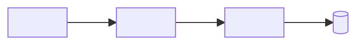

# <Module name>

## Overview

<What this module does for users and the business, in 2–4 sentences. What it does not do.>

## Architecture

<Main components and how they interact. Link each component's file.>

## Data model

| Entity | Collection / table | Key fields | Indexes | Notes |
|---|---|---|---|---|
| <Entity> | <name> | <field: type> | <index> | <constraints> |

## Interfaces

### Backend

| Method | Path | Auth | Request | Response | Errors |
|---|---|---|---|---|---|
| <GET> | <`/api/...`> | <role / public> | <body / query> | <shape> | <status: reason> |

### Frontend

| Route | Key components | State | Notes |
|---|---|---|---|
| <`/path`> | <Component> | <server / client store> | <loading, empty, error states> |

## Business rules and edge cases

- <Rule, with the file that enforces it>
- <Edge case and how it is handled>

## Permissions

| Action | Allowed roles | Enforced in |
|---|---|---|
| <action> | <roles> | <file> |

## Configuration

| Env var | Used by | Purpose |
|---|---|---|
| <`VAR_NAME`> | <app> | <what it controls> |

Names only. Never values.

## Events, jobs and integrations

- <Event / queue / cron / webhook / external API, producer and consumer>

## How to test

- Unit: <related test files and the single-file test command>
- Manual: <local URL, role, steps, expected result>

## Changelog

| Date | Ticket / PR | Summary |
|---|---|---|
| <YYYY-MM-DD> | <[KEY-123](<site>/browse/KEY-123)> | <one line> |
